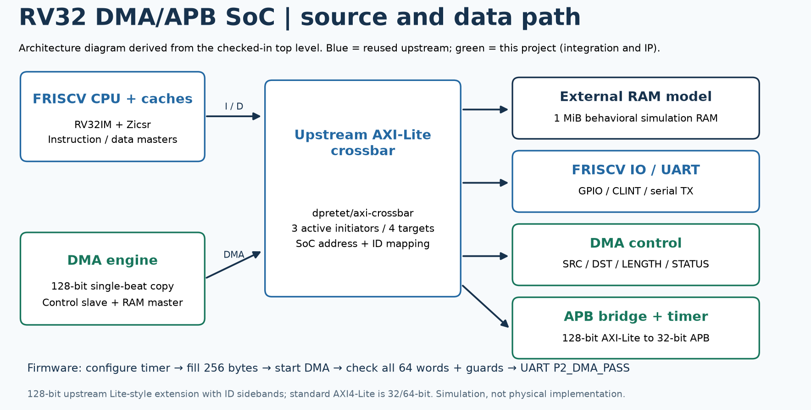

# RV32 DMA/APB SoC

A simulation SoC that runs bare-metal C on the open-source
[FRISCV](https://github.com/dpretet/friscv) RV32IM core. I added a DMA engine,
an AXI-Lite-to-APB bridge, an APB timer, the SoC top level and address map,
firmware, and the verification environment. While stress-testing the system
I also found and patched several bugs in the third-party CPU and cache.



## What runs

1. Firmware fills a 256-byte source buffer, programs the APB timer, and starts
   the DMA.
2. While the DMA copies, the CPU keeps reading RAM over the same crossbar.
3. The CPU checks all 64 destination words plus the guard words on both
   sides, then prints `P2_DMA_PASS` over the UART.
4. A second firmware image enables machine external interrupts. Timer and DMA
   interrupts are handled by a shared C ISR, which check `mcause`, clear the source and
   return through `MRET`.

## Who wrote what

| Part | Source |
| --- | --- |
| RV32IM CPU, I/D caches, UART/GPIO | [dpretet/friscv](https://github.com/dpretet/friscv) (MIT), pinned submodule `5bf6d1d` |
| AXI-Lite crossbar (arbitration, routing, DECERR) | [dpretet/axi-crossbar](https://github.com/dpretet/axi-crossbar) (MIT), pinned `7738a38` |
| SoC top, address/ID map, crossbar wrapper | this project: `rtl/soc/p2_soc_top.sv`, `p2_upstream_axil_fabric.sv` |
| DMA engine | this project: `rtl/soc/p2_dma.sv` |
| AXI-Lite → APB bridge | this project: `rtl/soc/p2_axil_apb_bridge.sv` |
| APB timer | this project: `rtl/p2_apb_timer.sv` |
| Firmware, testbenches, protocol checker, scripts | this project: `firmware/`, `tb/`, `scripts/` |
| Fixes to FRISCV / crossbar test models | this project: `tb/upstream_friscv/*.patch`, applied to a build copy only |

The submodule is never edited. `scripts/prepare_upstream.py` copies it into
`build/` and applies the patches in a fixed order.

## The IP blocks

**DMA.** Copies 16–4096 bytes between 16-byte-aligned, non-overlapping RAM
regions using 128-bit single-beat reads and writes. Registers: SRC, DST, LEN,
CTRL (START, IRQ_EN) and STATUS (BUSY, plus sticky W1C DONE / ERROR /
IRQ_PENDING / START_REJECT). A START while busy returns SLVERR. A bus error
ends the job with ERROR set. A hardware event wins over a same-cycle W1C.

**AXI-Lite → APB bridge.** Accepts AW and W in either order, selects one
32-bit lane of the 128-bit bus by `addr[3:2]`, rejects strobes outside that
lane before touching APB, holds the APB transfer through PREADY wait states,
forwards PSLVERR, and holds the AXI response under backpressure.

**APB timer.** CTRL, PERIOD, read-only COUNT and W1C STATUS. Periodic and
one-shot modes, byte strobes, interrupt mask. A new expiry wins over a
same-cycle W1C.

Details and the memory map: [docs/DESIGN.md](docs/DESIGN.md).

## Bugs found in the third-party RTL

Each fix is a separate patch with a test that fails on the original source
and passes after the patch. Summary:

| Area | Bug | Fix |
| --- | --- | --- |
| IO subsystem | AW and W in the same cycle → write happens but no B response | one-line state fix |
| D-cache | write hit reports success before the real B response and updates the line first; SLVERR/DECERR lost | every write waits for B, line updated only on OKAY |
| D-cache | AWREADY gated by tag availability but WREADY not → deadlock under B backpressure; AWPROT dropped | paired AW/W handshake; PROT queued with address |
| I-cache / fetch | bus error on fetch executed as an instruction and cached | error propagated as instruction access fault, no cache fill |
| Load/store unit | RRESP/BRESP ignored; failed load writes the register | precise load/store access faults with the right `mepc`/`mtval` |
| Control | younger JAL/EBREAK/FENCE.I retire before an older faulting load/store | wait for outstanding memory ops before redirecting |
| Control | enabled interrupt preempts an older queued memory fault; one-cycle re-entry window on MSTATUS write | older synchronous fault first; IRQ stays pending and is taken after `MRET` |

Write-ups: [IP audit](docs/IP_BUG_AUDIT.md),
[upstream regression and fault fixes](docs/UPSTREAM_REGRESSION.md),
[warning audit](docs/WARNING_AUDIT.md).

## Verification

Latest complete release regression and regenerated evidence: **2026-10-06**.
The [verification manifest](reports/p2_soc/verification-manifest.json) binds
the exact source files, patches and raw results.

- Unit/stress tests for the DMA, bridge and timer against independent
  reference models, with random wait states, backpressure, reset and error
  injection (3 seeds).
- 9 firmware-driven system scenarios on Verilator: baseline, 5 random-delay
  seeds, reset during DMA, and 2 interrupt scenarios.
- A protocol checker on 8 bus interfaces: payload and VALID must stay stable
  until READY.
- CPU fault regressions: 60 load/store-fault cases with younger instructions
  in flight, and 48 interrupt-vs-fault collision cases.
- The pinned upstream FRISCV ISA/CoreMark/crossbar suites, re-run with the
  patches applied.

Results and how to read them: [docs/VERIFICATION.md](docs/VERIFICATION.md).
Waveforms and UART decode: [reports/evidence](reports/evidence/README.md).

## Running it

WSL Ubuntu 24.04 with Git, GNU Make, Python 3, Verilator 5.050, Icarus
Verilog 12.0 and a RISC-V GCC 13.2 toolchain.

```bash
git clone --recurse-submodules https://github.com/tianruilint/rv32-dma-apb-soc.git
cd rv32-dma-apb-soc
make soc-system                  # the 9 system scenarios
bash scripts/run_release.sh      # everything (make verify), stops on first failure
```

## Limits

- The 128-bit bus is the upstream AXI-Lite-style single-beat extension with
  an ID sideband. It is not standard 32/64-bit AXI4-Lite, and there are no bursts.
- RAM is a 1 MiB behavioural model. The DMA buffers are in an uncached region,
  with no cache coherence.
- To keep faults precise, the patched CPU serialises memory instructions.
- Simulation only: no FPGA, synthesis or timing results for the SoC.

## License

New RTL is CERN-OHL-S-2.0 (see `LICENSE`). Upstream code keeps its MIT notices.
