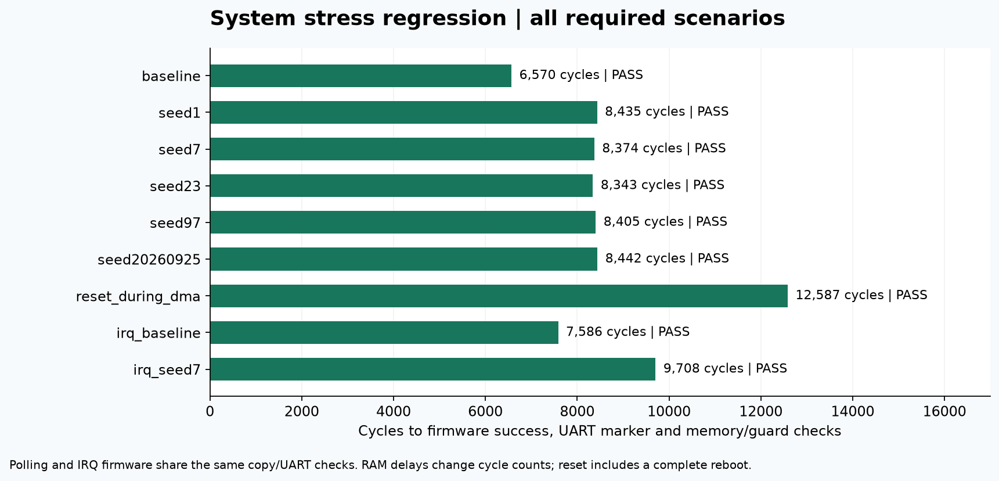
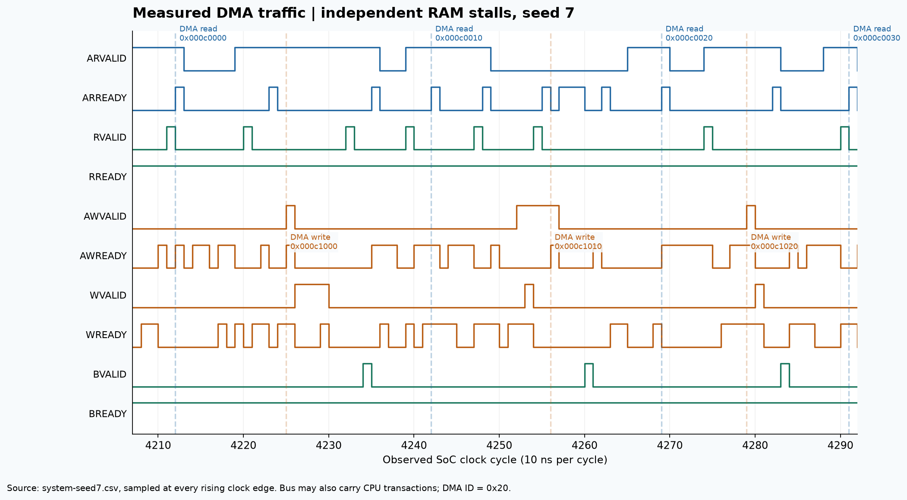
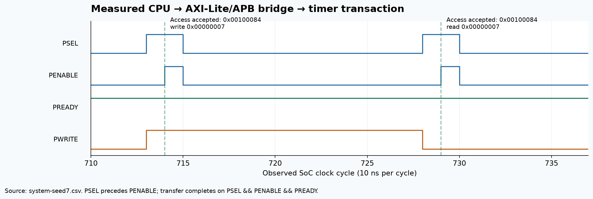
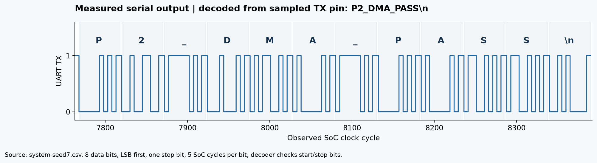

# Simulation evidence

Latest generation: **2026-10-06**, using the CSV traces from the same day's
complete release regression. The
[verification manifest](../p2_soc/verification-manifest.json) binds the source
and regression outputs; the figure manifest below binds those inputs to the
regenerated images.

All waveforms and result plots here are generated from recorded simulation
data. The architecture diagram is drawn from the top-level wiring. Each figure
comes as PNG and SVG; the raw CSV and its SHA-256 are listed in
[figure-manifest.json](figure-manifest.json).

## 1. Architecture

Blue: reused FRISCV CPU/cache/UART and axi-crossbar. Green: my integration and IP.

[SVG](architecture.svg) · [top level](../../rtl/soc/p2_soc_top.sv)

## 2. System regression

The same memory, guard, UART and protocol checks are run with plain RAM,
random wait states, reset during DMA, and interrupt-enabled firmware.

[SVG](system-regression.svg) · [per-scenario commands and results](../p2_soc/system-stress/summary.json)

## 3. DMA handshakes with wait states (seed 7)

RAM-side bus. The DMA uses ID `0x20`, and CPU traffic shares the same bus.
VALID holds until READY, and AW, W and B complete in different cycles.

[SVG](dma-waveform.svg) · [raw CSV](system-seed7.csv) · [log](../p2_soc/system-stress/seed7.log)

## 4. CPU access to the APB timer

A write and read-back of the timer PERIOD register. Setup (PSEL=1, PENABLE=0)
is followed by Access, which completes when PSEL, PENABLE and PREADY are all 1.

[SVG](apb-waveform.svg) · [raw CSV](system-seed7.csv)

## 5. UART decoded from the pin

The plotting script decodes the sampled UART TX line itself (start bit, 8
data bits, stop bit), and it must read `P2_DMA_PASS\n`. This is separate from
the testbench's own decoder.

[SVG](uart-evidence.svg)

## Regenerate

Run `make verify`, then `make evidence`. The figure script needs the packages
in `requirements-figures.txt` and refuses to plot if any system scenario
failed.
